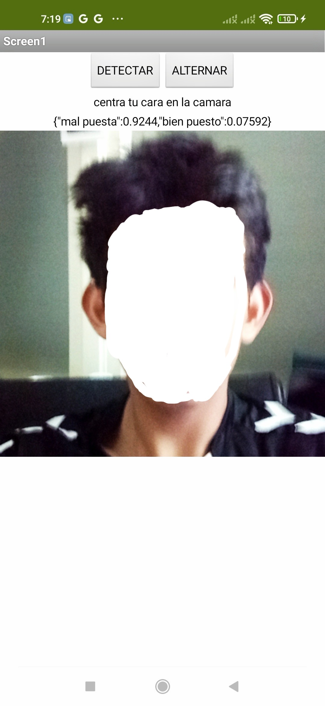
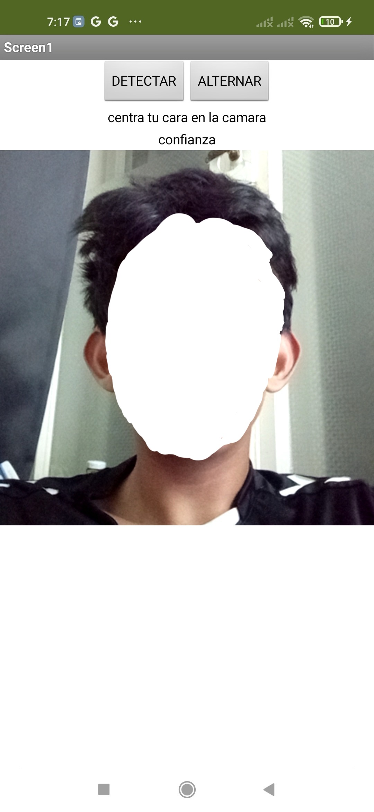

# 😷 detector_mascarilla – Face Mask Placement Detection App

**`detector_mascarilla`** is a mobile application built using **MIT App Inventor** that helps users ensure they are wearing their face mask correctly. It uses the device’s camera to detect whether a mask is well-placed (covering both nose and mouth) or worn improperly.

This app was developed as a personal learning project to explore camera input handling, real-time user feedback, and health-related tech applications.

---

## 📸 Screenshots

**Detection with improperly placed mask:**

**Detection with properly placed mask:**

---

## 💡 Features
- 📷 Detects face mask placement using the device camera
- ✅ Gives real-time feedback on mask status (`"mal puesta"` / `"bien puesto"`)
- 🔁 Toggle between camera states with "ALTERNAR" button
- 🌐 User interface in **Spanish** for accessibility
- 🧠 Output includes confidence scores for detection results

---

## 🛠️ Built With
- [MIT App Inventor](https://appinventor.mit.edu/)
- MIT AI2 Companion (for testing)
- Android smartphone (with camera)

---

## 🚀 How to Run the App

1. Open [MIT App Inventor](https://ai2.appinventor.mit.edu/)
2. Log in and click **Projects > Import project (.aia) from my computer**
3. Upload the `detector_mascarilla.aia` file from this repository
4. Use the **MIT AI2 Companion** app to test it on your Android device, or build an `.apk` file and install it manually

---

## 🧠 What I Learned
- Working with camera input and real-time feedback
- User interface design in Spanish
- Block-based programming with logic and decision flow
- How to test, improve, and debug interactive apps

---

## 📫 Contact

- 📧 Email: iandanielalfon@gmail.com  
- 🔗 LinkedIn: [Ian Alfonso](https://www.linkedin.com/in/ianalfonso)  
- 🏠 Based in Berlin, Germany

---

🙌 Thanks for checking out **detector_mascarilla**! Feel free to fork, improve, or reach out with feedback.

